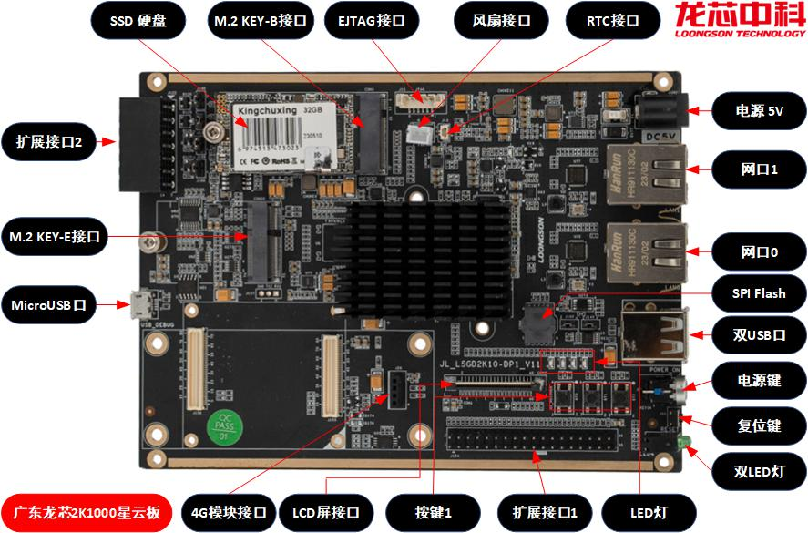
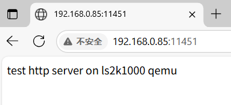

# LS2K1000LA on RT-Thread

RT-Thread诞生于2006年，是一款以开源、中立、社区化发展起来的物联网操作系统。 RT-Thread主要采用 C 语言编写，浅显易懂，且具有方便移植的特性（可快速移植到多种主流 MCU 及模组芯片上）。RT-Thread把面向对象的设计方法应用到实时系统设计中，使得代码风格优雅、架构清晰、系统模块化并且可裁剪性非常好

RT-Thread有完整版和Nano版，对于资源受限的微控制器（MCU）系统，可通过简单易用的工具，裁剪出仅需要 3KB Flash、1.2KB RAM 内存资源的 NANO 内核版本；而相对资源丰富的物联网设备，可使用RT-Thread完整版，通过在线的软件包管理工具，配合系统配置工具实现直观快速的模块化裁剪，并且可以无缝地导入丰富的软件功能包，实现类似 Android 的图形界面及触摸滑动效果、智能语音交互效果等复杂功能

## 板卡说明



龙芯2K1000LA是面向工业控制与终端等领域的低功耗通用处理器，片内集成2个LA264处理器核，采用LoongArch指令集，主频1GHz，64位DDR3控制器，芯片外围接口包括2个x4 PCIE2.0接口、1个SATA2.0接口、4个USB2.0接口、2路RGMII千兆网接口、2路DVO显示、64位DDR3及其它多种接口

龙芯2K1000LA星云板采用龙芯2K1000LA处理器，支持DDR3以及32GB SSD，带有SPI Flash，以及2路千兆RJ45，龙芯在Gitee上开源了板卡手册以及适配的软件资源（uboot、linux、buildroot等，以及工具链），板卡分别适配了旧世界ABI1.0与新世界ABI2.0，默认使用ABI2.0（仓库中BSP1.0/2.0是同样的意思）

[open-loongarch/docs-2k1000](https://gitee.com/open-loongarch/docs-2k1000)

## LS2K1000LA适配

本仓库在原有`bsp/qemu-virt-loongarch64`的RT-Thread移植基础上，添加了`bsp/loongarch/ls2kdev`的编译目标，对龙芯2K1000LA星云板做了基础适配，包括基本定义、中断控制器、串口、时钟等，并在此基础上添加了**GMAC网口**和**AHCI硬盘控制器**的驱动移植与适配

考虑到`qemu-virt-loongarch64`和龙芯2K系列嵌入式板卡之间的差异，以及功能完备性，对原有指令集相关代码做了一定的补充与修改

系统内存方面，目前只测试了基础的直接映射地址翻译模式，虚地址`0x8000`和`0x9000`开头的地址空间直接映射到对应的低地址物理空间中，其中`0x8000`部分为弱序非缓存`WUC`，`0x9000`部分为一致可缓存`CC`，特权级别均为`PLV0`

目前驱动以及系统适配都仅迈开第一步，基础功能做了初步实现，但完备性、稳定性、性能等方面有着较多欠缺，欢迎测试与反馈。另外在RT-Thread上测试时请关注线程栈大小的问题

## qemu-2k1000

[LoongsonLab/2k1000-materials](https://github.com/LoongsonLab/2k1000-materials)

qemu-2k1000是基于qemu 3.1.0适配的系统模拟器，处理器和外设方面与2k1000对齐，但细节上存在一定的问题，例如部分外设寄存器的取值、特权指令与CSR寄存器的定义与行为等

Github中提供了qemu-2k1000的软件压缩包，压缩包中的一些脚本是默认解压到/tmp中执行的，其中带有qemu-system-loongarch64等可执行文件、用于引导的uboot镜像、用于制作文件系统的文件/脚本、以及用于启动qemu的脚本

uboot镜像通过`-drive if=pflash,file=xxx`选项加载到qemu模拟的spi flash中，用于启动引导，文件系统镜像通过`-hda xxx`选项添加到模拟的AHCI硬盘中，存储的是文件系统与操作系统

## 驱动移植与适配

本次驱动移植主要适配了**GMAC网口**和**AHCI硬盘控制器**。驱动代码部分参考自开源项目，并在此基础上修改简化，龙芯已经为2k1000适配了linux、uboot等基础软件，因此可以通过适配的设备树来找到对应的驱动代码

linux中的网口和硬盘驱动代码是最为完备的，但均与其系统框架耦合较深，并且复杂度也较大，uboot、rtthread的其他板卡中也有部分相对应的驱动，但在实际的代码阅读中也或多或少发现了一定问题（例如对着手册上只读的寄存器多次写入等），因此三方的代码均有所参考、移植

目前驱动适配仅迈开第一步，基础功能做了初步实现，但精力有限，在驱动功能性、稳定性、性能、代码规范性等方面还有着较多欠缺，欢迎测试与反馈

### Rust与C驱动切换

当前rtthread中并没有提供原生rust适配框架，因此这里采用了手动提供.a文件链接的方式，默认使用C驱动

Rust代码编译好的.a文件存放在 drivers/libls2k_driver.a

此外需要修改如下三个config文件
- dirvers/SConscript
- drivers/ahci/SConscript
- drivers/net/SConscript

## 运行与测试（QEMU）

在2K1000LA上从零开始到运行RT-Thread并测试（qemu），整个流程较长，需要准备交叉工具链、运行环境（qemu）、uboot引导、系统镜像、文件系统等，不过在RT-Thread上，由于有比较多的软件包支持，对系统与驱动进行简易测试还是比较方便的

硬盘驱动方面，RT-Thread带有完备的文件系统框架，支持一些简单的文件系统，但如果需要读写ext4，就需要从online packages中获取并安装lwext4库，并且由于提供的lwext4在和RT-Thread的适配代码上有所欠缺，还需要稍微做一定的代码修改，实现对mbr分区扫描操作

网络方面，RT-Thread自带经过适配的lwip协议栈，并且它的online packages中也提供了如webclint、webnet等开源网络库，因此上手测试比较容易，不过相关的示例程序也存在各种各样的小问题，需要在过程中发现处理

### 板卡启动流程

在龙芯2K1000LA星云板上，主要的存储部件为SPI Flash和AHCI硬盘（插着SSD），不过能自由使用的就SSD，因为SPI Flash里存储着uboot固件

根据板卡手册，2K1000LA处理器复位后将从SPI Flash中取指，执行其中的uboot固件，对板卡和处理器进行初始化，并通过AHCI驱动扫描硬盘，读取其中的系统镜像引导执行

详情可以翻阅uboot源码，查找配置项`CONFIG_BOOTCOMMAND`，下面是2K1000的默认配置，它会按照ext4分区读取硬盘，引导启动`/boot/uImage`
```
CONFIG_BOOTCOMMAND="setenv bootargs ${bootargs} root=/dev/sda${syspart} mtdparts=${mtdparts} fbcon=rotate:${rotate} panel=${panel};sf probe;sf read ${fdt_addr} dtb;scsi reset;ext4load scsi 0:${syspart} ${loadaddr} /boot/uImage;bootm"
```

mkimage是uboot的一个重要工具，用于创建能够被uboot引导的镜像文件，在编译uboot时可以一起编译出mkimage，尽管诸如Ubuntu等发行版的包仓库里有mkimage，但由于上游uboot并没有适配LoongArch，因此需要用龙芯提供的uboot手动编译一带生成

### 安装工具链

龙芯在Gitee中提供了[loongarch64-linux-gnu](https://gitee.com/open-loongarch/cross-toolchain)工具链，用于编译uboot

LoongsonLab在Github中提供了[loongarch64-linux-musl](https://github.com/LoongsonLab/oscomp-toolchains-for-oskernel)工具链，用于编译RT-Thread

除此之外，如果希望体验到最新的LoongArch工具链，也可以尝试使用[crosstool-ng](https://github.com/crosstool-ng/crosstool-ng)来制作，上游已经合入了LoongArch的适配

### 编译uboot与mkimage

（本仓库在`tools/`中提供了已经编译好的`u-boot-with-spl.bin`和`mkimage`）

uboot源码
[u-boot: u-boot for loongson2](https://gitee.com/open-loongarch/u-boot)

编译参考手册
[龙芯2K1000星云板源码编译操作指南-v2.0](https://gitee.com/open-loongarch/docs-2k1000/blob/master/%E9%BE%99%E8%8A%AF2K1000%E6%98%9F%E4%BA%91%E6%9D%BF%E6%BA%90%E7%A0%81%E7%BC%96%E8%AF%91%E6%93%8D%E4%BD%9C%E6%8C%87%E5%8D%97-v2.0.md)

将uboot源码clone到本地
```
git clone https://gitee.com/open-loongarch/u-boot.git
```

修改set_env.sh，在abi2_toolchain_list中添加loongarch64-linux-gnu工具链的位置，并在setup_loongarch_env()根据实际情况调整LD_LIBRARY_PATH和CROSS_COMPILE的具体的值

执行配置脚本并编译
```
source ./set_env.sh abi2
./buildenv.sh 2k1000
make -j$(nproc)
```

编译完成后，需要如下的两个产物
```
tools/mkimage
u-boot-with-spl.bin
```

### 下载qemu-2k1000

[LoongsonLab/2k1000-materials](https://github.com/LoongsonLab/2k1000-materials)

包中除了qemu-system-loongarch64等二进制文件，还有用于制作镜像的2k1000/和runqemu脚本，我们只需要提供的qemu二进制，制作磁盘镜像和运行的流程会单独说明

### 包安装与编译RT-Thread

在rt_config.py中修改MKIMAGE为当前mkimage程序所在的路径

添加环境变量`RTT_EXEC_PATH`和`RTT_CC_PREFIX`，分别指向loongarch64-linux-musl的路径和前缀名
```
export RTT_EXEC_PATH=/home/tikifire/x-tools/loongarch64-unknown-linux-musl/bin
export RTT_CC_PREFIX=loongarch64-unknown-linux-musl-
```

#### 包管理器与包安装

进入`bsp/loongarch/ls2kdev`，输入配置指令
```
scons --menuconfig
```

可以打开配置界面，RT-Thread本身带有一些外部包源码，但往往需要通过pkgs来引入更多的包

[RT-Thread/env: Python Scripts for RT-Thread/ENV](https://github.com/RT-Thread/env#install-env)

安装RT-Thread的包管理器pkgs，安装时需要注意，它将写入~/.env文件夹，可能会有其他应用也在使用该文件夹

在每次打开新命令行使用时，需要先`source ~/.env/env.sh`

```
source ~/.env/env.sh

# 在`RT-Thread online packages`中选择需要引入的外部包
scons --menuconfig

# 配置完成后更新包状态
pkgs --update
```

在当前的配置下，下载安装的包列表为
```
$ pkgs --list
package name : b'webclient', ver : b'v2.2.0'
package name : b'webnet', ver : b'v2.0.3'
package name : b'netutils', ver : b'latest'
package name : b'mbedtls', ver : b'v2.28.1'
package name : b'lwext4', ver : b'latest'
package name : b'optparse', ver : b'latest'
package name : b'zlib', ver : b'latest'
```

#### 修改lwext4源码

为了能够成功识别boot sector，需要对lwext4源码做出如下的修改

在`bsp/loongarch/ls2kdev/packages/lwext4-latest/SConscript`中添加对`src/ext4_mbr.c`的编译
```
objs = Split('''
# 其他文件...
src/ext4_mbr.c
''')
```

`bsp/loongarch/ls2kdev/packages/lwext4-latest/ports/rtthread/dfs_ext_blockdev.c`中，库在读取`ext4_blockdev`结构时需要通过`part_offset`去定位ext4分区，但是适配的代码里直接将`part_offset`定为0，因此需要修改，并添加执行`ext4_mbr_scan`
``` diff
diff --git a/ports/rtthread/dfs_ext_blockdev.c b/ports/rtthread/dfs_ext_blockdev.c
index 45589c1..d331544 100644
--- a/ports/rtthread/dfs_ext_blockdev.c
+++ b/ports/rtthread/dfs_ext_blockdev.c
@@ -16,6 +16,7 @@
 #include <ext4_blockdev.h>

 #include "dfs_ext.h"
+#include "ext4_mbr.h"
 #include "dfs_ext_blockdev.h"

 static int blockdev_lock(struct ext4_blockdev *bdev);
@@ -87,7 +88,7 @@ static int blockdev_open(struct ext4_blockdev *bdev)
             return -RT_EIO;
         }

-        bdev->part_offset = 0;
+        // bdev->part_offset = 0;
         bdev->part_size = geometry.sector_count * geometry.bytes_per_sector;
         bdev->bdif->ph_bsize = geometry.block_size;
         bdev->bdif->ph_bcnt = bdev->part_size / bdev->bdif->ph_bsize;
@@ -201,6 +202,11 @@ int dfs_ext4_blockdev_init(struct dfs_ext4_blockdev* dbd, rt_device_t devid)
         bd->bdif = iface;
         bd->part_offset = 0;
         bd->part_size = 0;
+
+        // handle mbr sector
+        struct ext4_mbr_bdevs bdevs;
+        ext4_mbr_scan(bd, &bdevs);
+        bd->part_offset = bdevs.partitions[0].part_offset;
     }

     return 0;
```

#### 编译RT-Thread

```
scons --menuconfig
scons --clean
scons -j$(nproc)
```

软件会根据rt_config.py中的编译流程配置进行编译，生成rtthread.elf，并在此基础上通过mkimage获得可以被uboot引导的uImage

### 制作文件系统镜像

由于uboot的存在，磁盘镜像需要带分区表+ext4分区，如果直接挂载裸ext4文件系统镜像，uboot会报错`No partition table - scsi 0`

下面借助nbd和qemu提供的工具来制作2G的镜像`2kfs.img`，文件系统中只需要`boot/uImage`
```
# 启动内核的nbd
sudo modprobe nbd max_part=12

# 创建2G的qcow2格式镜像2kfs.img
qemu-img create -f qcow2 2kfs.img 2G
# 将2kfs.img连接到/dev/nbd0
sudo qemu-nbd -c /dev/nbd0 ./2kfs.img

# 对镜像分区，主分区且1块分区，全部范围，执行完后会出现/dev/nbd0p1
sudo echo -e 'n\n\n\n\n\n\nw\nq\n'| sudo fdisk /dev/nbd0
# 对分区创建ext4文件系统，-O ^metadata_csum避免u-boot报错
sudo mkfs.ext4 /dev/nbd0p1 -O ^metadata_csum

# 挂载到文件夹中进行访问
mkdir ./fs
sudo mount /dev/nbd0p1 ./fs

# 创建/boot并放入uImage
sudo mkdir boot
sudo cp <path-to-uImage> ./boot/

# 断开挂载
sudo umount ./fs
# 断开/dev/nbd0连接
sudo qemu-nbd -d /dev/nbd0
```

每次对镜像内的文件进行修改时，需要先使用qemu-nbd连接到/dev/nbd0，挂载分区到某个文件夹中，再进行操作

### 启动

``` bash
./bin/qemu-system-loongarch64   -M ls2k   -serial stdio   -serial vc   -drive if=pflash,file=./u-boot-with-spl.bin   -m 1024   -device usb-kbd,bus=usb-bus.0   -device usb-tablet,bus=usb-bus.0   -net nic   -net user,net=192.168.1.0/24,tftp=/srv/tftp,hostfwd=tcp::11451-:80   -vnc :0   -D /tmp/qemu.log   -s   -hda ./2kfs.img
```

运行选项说明
- `-drive if=pflash,file=./u-boot-with-spl.bin` 加载uboot到SPI Flash中
- `-hda ./2kfs.img` 加载磁盘镜像到硬盘中
- `-net nic -net user,net=192.168.1.0/24,tftp=/srv/tftp,hostfwd=tcp::11451-:80`，使用qemu的用户模式网络栈，`net=`设置guest所处的子网，`hostfwd=`将host的tcp 11451端口连接重定向到guest的80端口，`tftp=`开启qemu自带的tftp服务器，uboot可以通过tftp实现网络加载kernel或者资源更新

需要注意的是，在qemu的`-net user`下，host/外网连接到guest内部一般需要配置hostfwd，guest连接到host/外网一般没有问题，不过如果你要在guest内使用ICMP报文/ping到外网，需要在host上做如下的配置
```
# 为group 100开启icmp sockets
echo 100 100 > /proc/sys/net/ipv4/ping_group_range
# 或（如果group 100不起效）
sudo sysctl -w net.ipv4.ping_group_range='0 2147483647'
```

### 测试说明

需要测试的是硬盘和网口驱动程序，两者可以通过诸如网络传输下载文件等方式做联调

命令行中输入help可以看到系统所有自带的程序

#### ifconfig

ifconfig可以查看当前网络状态，驱动默认会挂载网络设备`e0`
```
msh />ifconfig
network interface device: e0 (Default)
MTU: 1500
MAC: 00 55 7b b5 7d f7
FLAGS: UP LINK_UP INTERNET_UP DHCP_ENABLE ETHARP BROADCAST IGMP
ip address: 192.168.1.15
gw address: 192.168.1.2
net mask  : 255.255.255.0
dns server #0: 192.168.1.3
dns server #1: 0.0.0.0
```

#### ping

RT-Thread的lwip中自带了ping程序，可以用于测试基础的网络功能与icmp协议

```
Hi, this is RT-Thread!!
Hello LoongArch64!
msh />Link is up in FULL DUPLEX mode
Link is with 1000M Speed
ping www.baidu.com
ping: not found specified netif, using default netdev e0.
60 bytes from 180.101.49.44 icmp_seq=1 ttl=255 time=10 ms
60 bytes from 180.101.49.44 icmp_seq=2 ttl=255 time=11 ms
60 bytes from 180.101.49.44 icmp_seq=3 ttl=255 time=20 ms
60 bytes from 180.101.49.44 icmp_seq=4 ttl=255 time=9 ms

--- 180.101.49.44 ping statistics ---
4 packets transmitted, 4 received, 0% packet loss
minimum = 9ms, maximum = 20ms, average = 12ms
```

#### WebClinet

RT-Thread的online packages中提供了一个名为WebClinet的HTTP/HTTPS客户端，自带例如wget、web_get_test、web_post_test、web_shard_test等示例程序，此外可以在配置中开启TLS来支持HTTPS，不过该功能要求RTC，目前还未适配RTC，虽然系统提供了模拟RTC选项，但在运行时存在一定bug，所以目前只能测试HTTP协议

使用web_get_test测试HTTP GET（调用一个天气API）
```
msh />web_get_test http://t.weather.itboy.net/api/weather/city/101190401
webclient get response data:
{"message":"success感谢又拍云(upyun.com)提供CDN赞助","status":200,"date":"20250714","time":"2025-07-14 19:55:59","cityInfo":{"city":"苏州市","citykey":"101190401","parent":"江苏","updateTime":"18:08"},"data":{"shidu":"41%","pm25":14.0,"pm10":21.0,"quality":"优","wendu":"32.7","ganmao":"各类人群可自由活动","forecast":[{"date":"14","high":"高温 34℃","low":"低温 25℃","ymd":"2025-07-14","week":"星期一","sunrise":"05:03","sunset":"19:03","aqi":38,"fx":"西北风","fl":"3级","type":"多云","notice":"阴晴之间，谨防紫外线侵扰"},
...............
,{"date":"28","high":"高温 29℃","low":"低温 25℃","ymd":"2025-07-28","week":"星期一","sunrise":"05:11","sunset":"18:56","aqi":41,"fx":"西北风","fl":"2级","type":"中雨","notice":"记得随身携带雨伞哦"}],"yesterday":{"date":"13","high":"高温 29℃","low":"低温 26℃","ymd":"2025-07-13","week":"星期日","sunrise":"05:02","sunset":"19:04","aqi":46,"fx":"西北风","fl":"2级","type":"小雨","notice":"雨虽小，注意保暖别感冒"}}}
msh />
```

使用wget测试HTTP下载网页或者文件并保存到本地，目前下载较为稳定，测试通过1GB级别文件的稳定传输，不过速度很慢，大约在1MB/s左右

外部通过python开启一个简易的HTTP服务器
```
python -m http.server 8081
```

内部使用wget启动下载测试，可以通过nethogs等工具观察到速率，该工具在接收满一个缓冲区后就会输出一次`>`，而缓冲区默认定义较小，导致大量的`>`输出
```
msh /test>wget http://192.168.0.85:8081/qemu-1000M qemu-1000M
```


#### WebNet

与WebClinet相对应，WebNet是一个轻量、嵌入式级的Web服务器组件，不过目前小问题较多

WebNet自带webnet示例程序，可以将当前某个目录通过某个端口对外提供web服务，端口和目录均可配置，默认是/webnet文件夹，下面/webnet将通过80端口对外提供服务，/webnet内是一个简易的index.html，以及一个10M的文件

```
msh />cd webnet
msh /webnet>ls
Directory /webnet:
.                   <DIR>
..                  <DIR>
index.html          33
qemu-10M            10485760
msh /webnet>cat index.html
test http server on ls2k1000 qemu
msh /webnet>webnet_test
[I/wn] RT-Thread webnet package (V2.0.3) initialize success.
msh /webnet>
```

qemu将外部的11451端口forward到内部的80端口上，主机可以通过11451端口来访问该web服务，不过目前存在连接不稳定的bug，host上使用wget获取大文件会出现断连
```
tikifire@LAPTOP-XXXXXXXX:~$ curl http://192.168.0.85:11451/
test http server on ls2k1000 qemu
tikifire@LAPTOP-XXXXXXXX:~$
```

